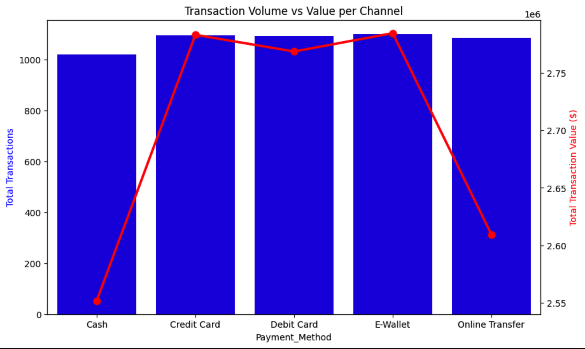
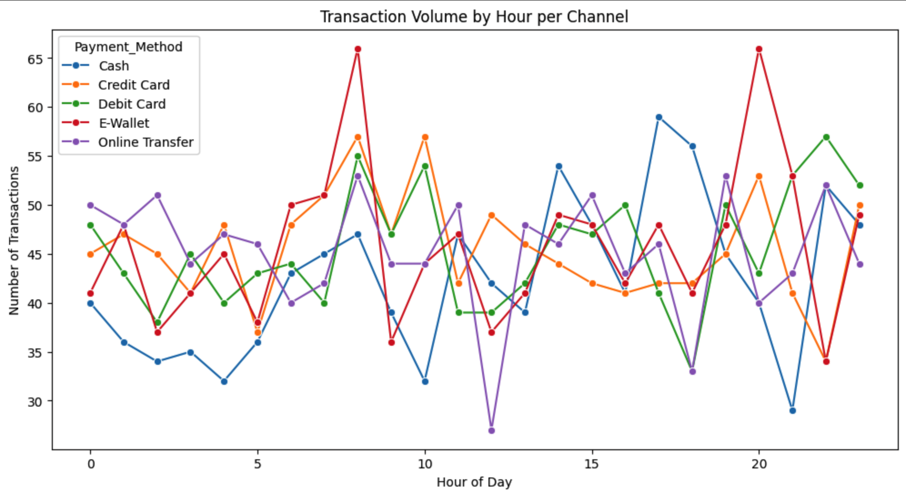
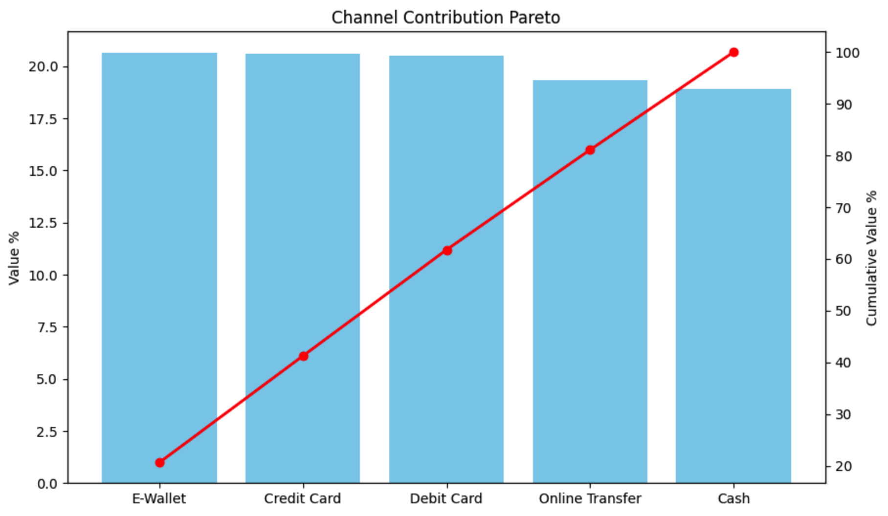
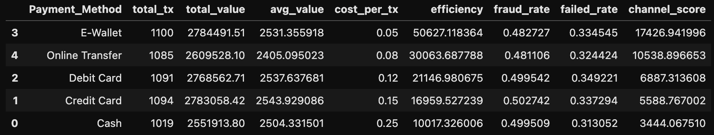

# Banking Channel Performance & Transaction Efficiency Analysis

- Dataset: [USA Banking Transactions Dataset (2023-2024)](https://www.kaggle.com/datasets/pradeepkumar2424/usa-banking-transactions-dataset-2023-2024)  
- Notebook: banking-channel-analysis.ipynb

---

## 1. Background and Overview

In modern banking systems, transactions are distributed across multiple channels such as Cash, Card-based payments, E-Wallets, and Online Transfers.

Optimizing channel performance is critical to:
- Reduce operational costs
- Improve transaction efficiency
- Enhance customer experience
- Minimize fraud and system failure risks

This project evaluates how different channels perform across volume, value, cost efficiency, and operational risk.

Key business questions:
- Which channels contribute the most in volume and value?
- How efficient is each channel relative to its cost?
- When do transaction peaks occur?
- Which channels carry higher operational risks (fraud & failure)?
- How should banks prioritize channel investment?

---

## 2. Data Structure Overview

The dataset contains ~5,000 transaction records with 20 features.

Key Dimensions:

- Time: Transaction_Date (hourly derived)
- Channel: Payment_Method (Cash, Credit Card, Debit Card, E-Wallet, Online Transfer)
- Customer: Age, Gender, Income, Occupation
- Transaction: Amount, Type, Category
- Risk: Fraud_Flag, Transaction_Status

Derived Metrics:

- Transaction Hour: Extracted from timestamp
- Fraud Rate (%): % of fraudulent transactions per channel
- Failure Rate (%): % of failed transactions per channel
- Channel Efficiency Score: Value-to-cost ratio adjusted by fraud and failure rates

---

## 3. Executive Summary

This analysis reveals four key findings:

1. **E-Wallet as the Most Efficient Channel:** E-Wallet achieves the highest efficiency score due to very low operational cost while maintaining competitive transaction value.
2. **Clear Peak Transaction Windows:** Transaction activity is concentrated in morning (8–10 AM) and evening (~8 PM), creating predictable infrastructure load spikes.
3. **Balanced Channel Contribution:** All channels contribute relatively evenly to total transaction value, indicating no single point of dependency.
4. **Operational Risk is Systemic:** Fraud and failure rates are relatively similar across channels, suggesting system-wide optimization is needed rather than channel-specific fixes.

---

## 4. Insights Deep Dive

### Transaction Volume vs Value per Channel

  

Insight:

- E-Wallet and Credit Card dominate both transaction volume and total value.
- Online Transfer has high usage but lower average transaction value.

Implication:

- Digital channels are the primary drivers of transaction scale.
- Increasing average transaction value in Online Transfer could unlock additional revenue.

### Time-Based Patterns per Channel

  

Insight:

- Transactions peak at 8–10 AM and ~8 PM.
- E-Wallet shows the highest spike among all channels.

Implication:

- Infrastructure must be optimized for peak-hour reliability.
- Opportunity to redistribute load via off-peak incentives.

### Channel Contribution Analysis (Pareto)

  

Insight:

- Transaction value contribution is evenly distributed across channels.
- No dominant channel (>30%), cumulative contribution is nearly linear.

Implication:

- All channels remain strategically important.
- Optimization should focus on efficiency, not elimination.

### Channel Efficiency & Risk Analysis

  

Insight:

- E-Wallet ranks highest in efficiency due to low cost structure.
- Cash ranks lowest due to high operational cost.
- Debit Cards show relatively higher failure rates.

Implication:

- Digital channels provide the strongest ROI.
- Operational improvements are needed for card-based systems.
- Cash should be gradually deprioritized.

## 5. Recommendations
- **Scale E-Wallet as Primary Channel:** Prioritize E-Wallet expansion through incentives and ecosystem integration, as it delivers the highest efficiency with low cost and strong transaction value, making it the main driver of scalable profitability.
- **Optimize Peak Hour Infrastructure:** Strengthen system capacity during peak hours (8–10 AM and ~8 PM) using load balancing and traffic redistribution to reduce failure rates and protect revenue continuity.
- **Improve Debit Card Reliability:** Address higher failure rates in debit card transactions by optimizing authorization systems and implementing retry mechanisms to reduce transaction drop-offs and revenue leakage.
- **Accelerate Cash-to-Digital Migration:** Gradually reduce reliance on cash by introducing behavioral incentives and improving digital accessibility, lowering operational costs while increasing transaction traceability.
- **Maintain Balanced Channel Strategy:** Optimize each channel based on its role rather than eliminating any, ensuring system resilience while maximizing overall transaction efficiency.
